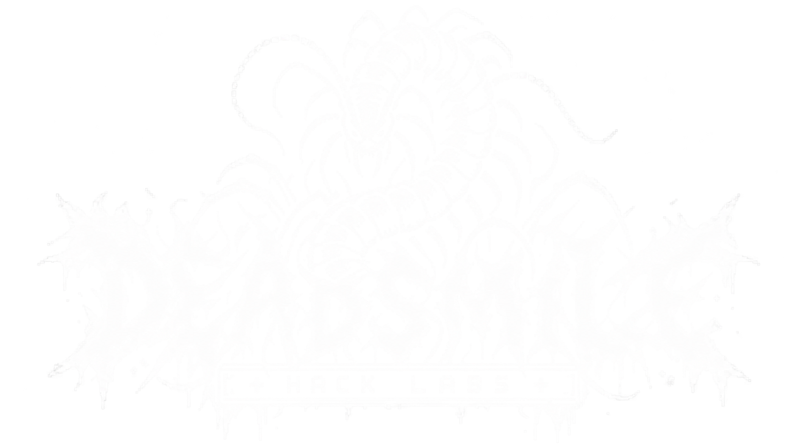

<div align="center">



# Dead Smile Labs

**Terminal DENPA Micro Blog**

A retro terminal-styled micro blog with admin dashboard, built with Node.js, SQLite, and Vue.js.

[](https://nodejs.org)
[](https://vuejs.org)
[](https://sqlite.org)
[](https://docker.com)

---

A brutalist, retro terminal-aesthetic blog platform featuring markdown support, image uploads, and a full admin dashboard.

</div>

## Features

- **Retro Terminal Design** — Black & white brutalist aesthetic with monospace fonts
- **Admin Dashboard** — Full CRUD for articles and categories
- **Markdown Editor** — Write content in markdown with live preview
- **Image Uploads** — Upload and manage images for articles
- **Authentication** — Secure login system for the dashboard
- **SQLite Database** — Lightweight, zero-config database
- **Docker Ready** — Deploy anywhere with Docker/Dokploy
- **Responsive** — Works on desktop and mobile

## Tech Stack

| Layer | Technology |
|-------|------------|
| Backend | Node.js + Express.js |
| Database | SQLite (better-sqlite3) |
| Frontend | HTML/CSS + Vue.js 3 |
| Markdown | marked.js |
| Uploads | Multer |
| Container | Docker |

## Quick Start

### Local Development

```bash
# Clone the repository
git clone https://github.com/yourusername/dead-smile-labs.git

# Navigate to the project
cd dead-smile-labs

# Install dependencies
npm install

# Start the server
npm start
```

Open [http://localhost:3000](http://localhost:3000)

### Docker

```bash
# Build and run with Docker Compose
docker-compose up --build

# Or build manually
docker build -t deadsmile .
docker run -p 3000:3000 deadsmile
```

## Dashboard Access

| Field | Value |
|-------|-------|
| URL | `http://localhost:3000/admin` |
| Username | `xergno` |
| Password | `simbionte666` |

## Project Structure

```
deadsmile-labs/
├── img/
│   └── logo.png              # Site logo
├── css/
│   └── dashboard.css         # Dashboard styles
├── public/
│   ├── admin/
│   │   └── index.html        # Vue.js dashboard
│   └── js/
│       ├── dashboard.js      # Vue.js app
│       ├── vue.global.prod.js
│       └── marked.min.js
├── uploads/                  # User uploads (persistent)
├── data/                     # SQLite database (persistent)
├── index.html                # Public homepage
├── project-*.html            # Article detail pages
├── style.css                 # Public styles
├── server.js                 # Express backend
├── package.json
├── Dockerfile
├── docker-compose.yml
└── .dockerignore
```

## Deploy to Dokploy

1. Push code to a Git repository
2. Create a new **Docker** application in Dokploy
3. Set environment variables:
   ```
   NODE_ENV=production
   PORT=3000
   ```
4. Configure persistent volumes:
   - `/app/data` — Database storage
   - `/app/uploads` — Image uploads
5. Set health check: `/api/health`
6. Deploy!

## Markdown Support

The editor supports full markdown syntax:

```markdown
# Heading 1
## Heading 2

**Bold text** and *italic text*


> Blockquote

- List item 1
- List item 2

`inline code`

[Link text](https://example.com)
```

## API Endpoints

| Method | Endpoint | Description |
|--------|----------|-------------|
| POST | `/api/login` | Authenticate user |
| POST | `/api/logout` | End session |
| GET | `/api/auth` | Check auth status |
| GET | `/api/health` | Health check |
| GET | `/api/articles` | List articles |
| POST | `/api/articles` | Create article |
| PUT | `/api/articles/:id` | Update article |
| DELETE | `/api/articles/:id` | Delete article |
| GET | `/api/categories` | List categories |
| POST | `/api/categories` | Create category |
| PUT | `/api/categories/:id` | Update category |
| DELETE | `/api/categories/:id` | Delete category |
| POST | `/api/upload` | Upload image |

## License

MIT

---

<div align="center">

**Dead Smile Labs** © 2026

*terminal.denpa.labs*

</div>